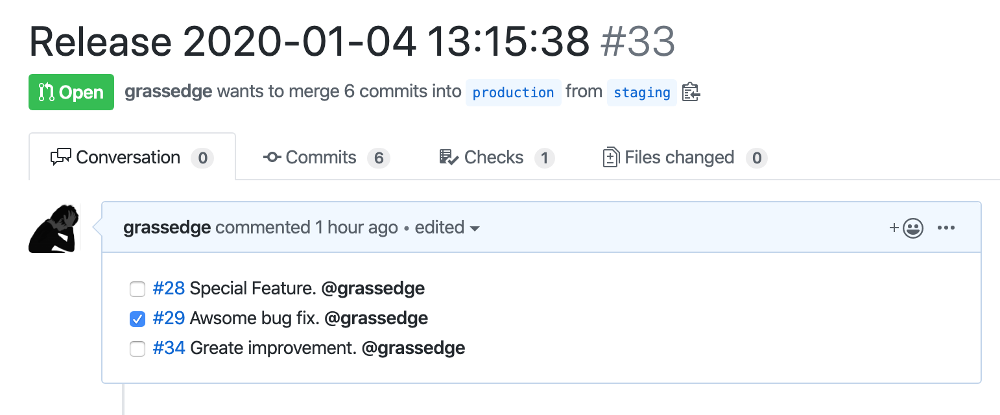

# git-pr-release-action

Create a pull-request for the production release.

If your team adopts a workflow like 'GitLab flow', you may have two branches, such as production and pre-production (or staging and so on).
This action helps to list up pull-requests related to commits between production and pre-production. And creates (or updates) a new pull-request with the list in the body.

This action is inspired by [motemen/git-pr-release](https://github.com/motemen/git-pr-release) and [uiur/github-pr-release](https://github.com/uiur/github-pr-release).

## How to release a new version

### Create a tag
- If you perform a change on your pr run `npm run package`
- When the pr get merged create a release [clicking here](https://github.com/SplashThat/git-pr-release-action/releases/new)
- Click on "choose tag" and type your version, for example if you fixed a bug and we were on v1.1.5 you have to type v1.1.6 as we follow semver for versioning our action.
- Click on "generate release notes", this will automatically add on the release description a list of the PR's included between this and the last pushed tag.
- Click on "publish release"

### Reference your recently created tag to the major version tag.

- Now go to actions
- Click on "Update main version"
- Click on the "run workflow" button
- Now under "The tag or reference to use" type the tag name you just created, according to the example shown before it should be, for example `v1.1.6`
- Select the major version to update you wanna reference, in this case will be `v1`
- Click "run workflow" green button again.


**Why do we do that?**
Referencing the major tag to your recently created tag ensures that the major version tag always points to the latest release, facilitating consistent version tracking and automation in GitHub Actions.

## Usage

This Action subscribes to Push events.

```workflow
name: Create a release pull-request
on:
  push:
    branches:
      - pre-production
jobs:
  release_pull_request:
    runs-on: ubuntu-latest
    name: release_pull_request
    steps:
      - name: checkout
        uses: actions/checkout@v1
      - name: create-release-pr
        uses: grassedge/git-pr-release-action@v1.0
        with:
          base: production
          head: pre-production
          token: ${{ secrets.GITHUB_TOKEN }}
          labels: a,b,c
          assign: true
          requestReviewers: true
```

**input**

- `owner`: Default is current reopsitory's owner.
- `repo`: Default is current reopsitory's name.
- `base`: **required** Base branch of the release pull-request.
- `head`: **required** Head branch of the release pull-request. Typically, it is the same as a subscribed branch.
- `assign`: If true, assign each pull-req's assignees to the release pull-req
- `labels`: Labels that is added to the release pull-request
- `template`: Path to the template you want to use.
- `tz`: Used to generate the version string.
- `token`: **required** `GITHUB_TOKEN` for creating a pull request.

Note that this action uses the template file in your repository. So you need 'checkout' step if you specify template option.

## Demo



## License

The scripts and documentation in this project are released under the [MIT License](LICENSE).
